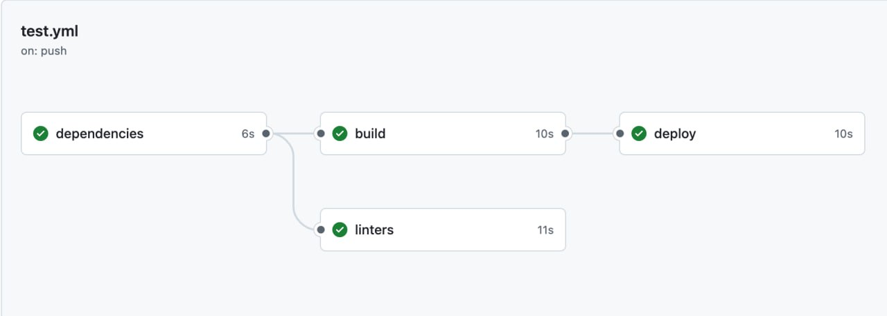

# GitHub actions

Ваша задача написать Github Actions конфиг:

Внутри каждой джобы позовите соотвествующий скрипт из package.json (кроме dependencies).

Для написания конфига и его запуска форкните репозиторий на github.

Все джобы перед запуском должны подождать dependencies, а deploy еще и build.

Для проверки вызовите `yarn test:github URL` и впишите в аргумент URL полный адрес до прогона пайплайна.

Пример: `yarn test:github 'https://github.com/kholstinin/infra-homework/actions/runs/12493719729'`

## Подсказки

[Документация GitHub Actions](https://docs.github.com/en/actions/writing-workflows/workflow-syntax-for-github-actions)

Вам нужно использовать actions checkout и setup-node.

У setup-node есть аргумент для кэширования.

У yarn кэшируется не node_modules, а кэш в .yarn, поэтому установку зависимостей все равно нужно звать в каждой джобе (с кэшом это занимает несколько секунд).
