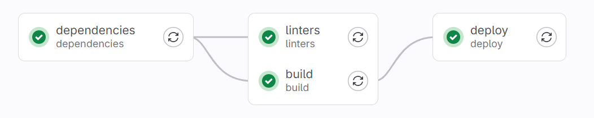

# GitHub CI/CD

Ваша задача написать GitLab CI конфиг:

Требования к пайплайну идентичны предыдущему заданию.

Зарегистрируйтесь на https://course.gitlab.yandexcloud.net/ и форкните [репозиторий](https://course.gitlab.yandexcloud.net/infra/homework).

Для проверки вызовите `yarn test:gitlab URL` и впишите в аргумент URL полный адрес до прогона пайплайна.

Пример: `yarn test:gitlab 'https://course.gitlab.yandexcloud.net/username/homework/-/pipelines/7'`

## Подсказки

[Документация Gitlab CI/CD](https://docs.gitlab.com/ee/ci/yaml/)
