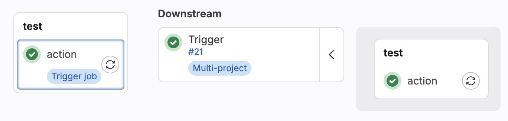
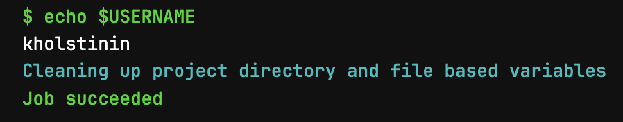

# Дополнительные задания GitLab CI/CD

Это дополнительные задания по GitLab CI/CD на время новогодних праздников.

## Дочерние пайплайны

Создайте проект в gitlab и вызовите в нем пайплайн [infra/child](https://course.gitlab.yandexcloud.net/infra/child).

Выглядит это так:

В дочерний пайплайн также нужно пробросить логин учетной записи (из [predefined variables](https://docs.gitlab.com/ee/ci/variables/predefined_variables.html)).

## Сломанный пайплайн

Форкните [репозиторий](https://course.gitlab.yandexcloud.net/infra/broken) и добейтесь работоспособности пайплайна исправив ошибки в конфиге.

## Переменные и окружения

Форкните [репозиторий](https://course.gitlab.yandexcloud.net/infra/environments) и добейтесь работоспособности пайплайна настроив в репозиторий environments.

Менять gitlab-ci.yml нельзя.

Обратите внимание что environments чувствителен к регистру.
